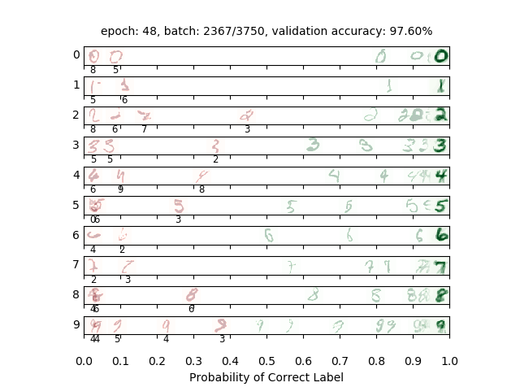
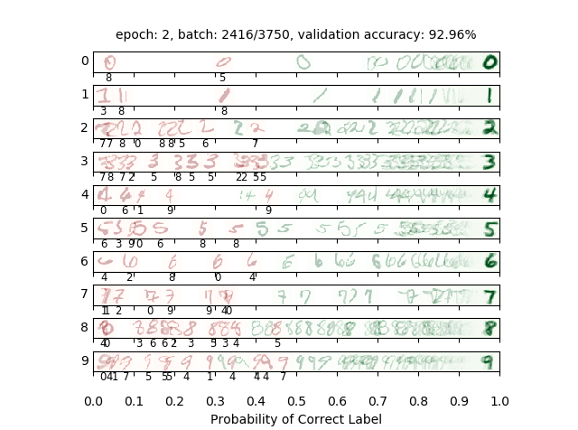
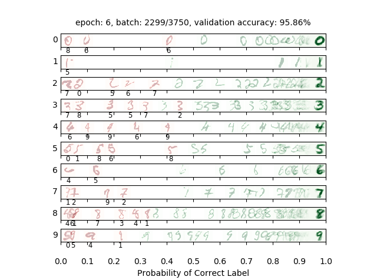
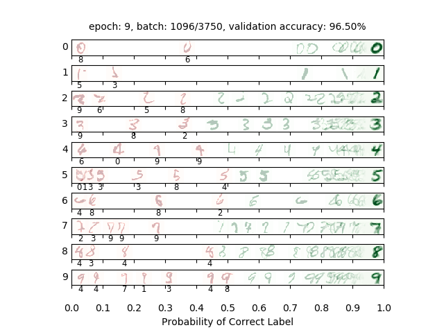
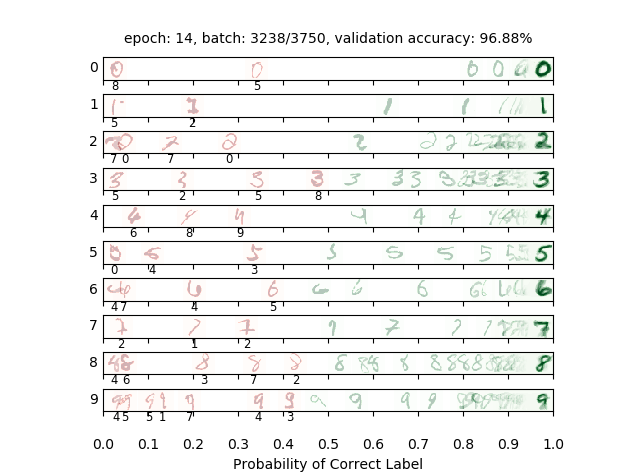
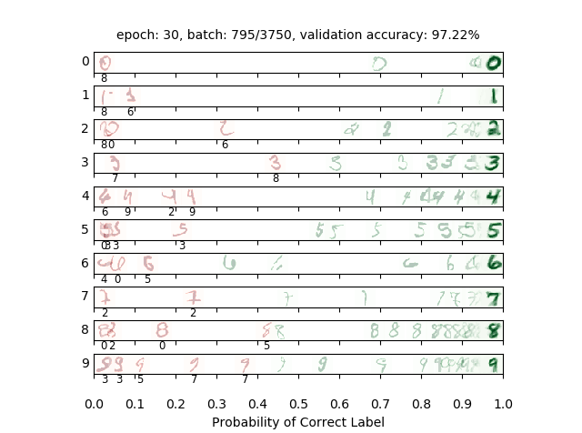
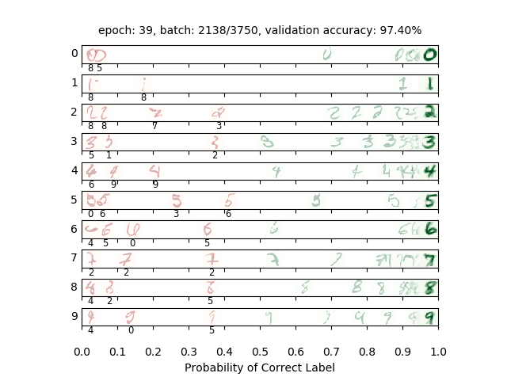
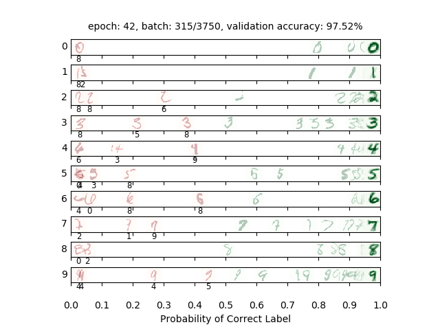
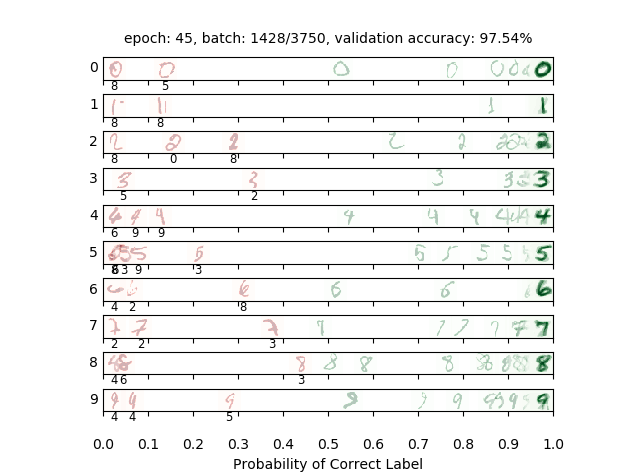

# digitClassifier

A machine learning neural network that classifies handwritten digits from the MNIST dataset.
### Preview

### Motivation
This project is one of the course projects from Artificial Intelligence course at UC Berkeley.  I have already had Machine Learning (ML) related project in another course Optimization at the same university. This time my job is to train a model to classify digits written by humans. It is essential for me because the project is challenging as it contains hyperparameters that I have to consistently change in order to maximize accuracy of classifying digits correctly. In the end, the classifer can reach accuracy to 97.6% using the testing set.

### Description
- Implemented parts of the existing models for natural language processing.
- Trained a network to analyze information.
- Classified handwritten digits from the MNIST dataset.

### Skills to learn
- Python
- Natural Language Processing
- Machine Learning
